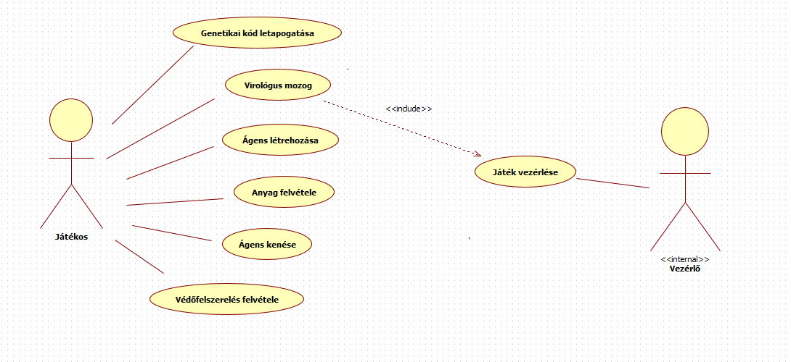

2. Követelmény, projekt, funkcionalitás _[Csapat neve__]_

# 2.Követelmény, projekt, funkcionalitás

## 2.1Bevezetés

### 2.1.1Cél

_[A dokumentum célja]_

### 2.1.2Szakterület

_[A kialakítandó szoftver milyen területen használható, milyen célra]_

### 2.1.3Definíciók, rövidítések

_[A dokumentumban használt definíciók, rövidítések magyarázata]_

### 2.1.4Hivatkozások

_[A dokumentumban használt anyagok, web-oldalak felsorolása]_

### 2.1.5Összefoglalás

_[A dokumentum további részeinek rövid ismertetése]_

## 2.2Áttekintés

### 2.2.1Általános áttekintés

_[A kialakítandó szoftver legmagasabb szintű architekturális képe. A fontosabb alrendszerek felsorolása, a közöttük kialakítandó interfészek lényege, a felhasználói kapcsolatok alapja. Esetleges hálózati és adattárolási elvárások.]_

### 2.2.2Funkciók

_[A feladat kb. 4000 karakteres (kb 1,5 oldal) részletezettségű magyar nyelvű leírása. Nem szerepelhetnek informatikai kifejezések.]_

### 2.2.3Felhasználók

_[A felhasználók jellemzői, tulajdonságai]_

### 2.2.4Korlátozások

_[Az elkészítendő szoftverre vonatkozó – általában nem funkcionális - előírások, korlátozások.]_

### 2.2.5Feltételezések, kapcsolatok

_[A Hivatkozásokban felsorolt anyagok, web-oldalak kapcsolódása a feladathoz, melyik milyen szempontból érdekes, milyen inputot ad.]_

## 2.3Követelmények

### 2.3.1Funkcionális követelmények

_[Az alábbi táblázat kitöltésével készítendő. Dolgozzon ki követelmény azonosító rendszert! Az ellenőrzés módja szokásosan bemutatás és/vagy kiértékelés. Prioritás lehet alapvető, fontos, opcionális. Az alapvető követelmények nem teljesítése végzetes. Forrás alatt a követelményt előíró anyagot, szervezetet kell érteni. Esetünkben forrás lehet maga a csapat is, mikor ő talál ki követelményt. Use-case-ek alatt az adott követelményt megvalósító használati esete(ke)t kell megadni.]_

| **Azonosító** | **Leírás** | **Ellenőrzés** | **Prioritás** | **Forrás** | **Use-case** | **Komment** |
| --- | --- | --- | --- | --- | --- | --- |
|
 |
 |
 |
 |
 |
 |
 |

### 2.3.2Erőforrásokkal kapcsolatos követelmények

_[A szoftver fejlesztésével és használatával kapcsolatos számítógépes, hardveres, alapszoftveres és egyéb architekturális és logisztikai követelmények]_

| **Azonosító** | **Leírás** | **Ellenőrzés** | **Prioritás** | **Forrás** | **Komment** |
| --- | --- | --- | --- | --- | --- |
|
 |
 |
 |
 |
 |
 |

### 2.3.3Átadással kapcsolatos követelmények

_[A szoftver átadásával, telepítésével, üzembe helyezésével kapcsolatos követelmények]_

| **Azonosító** | **Leírás** | **Ellenőrzés** | **Prioritás** | **Forrás** | **Komment** |
| --- | --- | --- | --- | --- | --- |
|
 |
 |
 |
 |
 |
 |

### 2.3.4Egyéb nem funkcionális követelmények

_[A biztonsággal, hordozhatósággal, megbízhatósággal, tesztelhetőséggel, a felhasználóval kapcsolatos követelmények]_

| **Azonosító** | **Leírás** | **Ellenőrzés** | **Prioritás** | **Forrás** | **Komment** |
| --- | --- | --- | --- | --- | --- |
|
 |
 |
 |
 |
 |
 |

## 2.4Lényeges use-case-ek

_[A 2.3.1-ben felsorolt követelmények közül az alapvető és fontos követelményekhez tartozó használati esetek megadása az alábbi táblázatos formában.]_

### 2.4.1Use-case leírások

_[Minden use-case-hez külön]_

| **Use-case neve** |
 |
| --- | --- |
| **Rövid leírás** |
 |
| **Aktorok** |
 |
| **Forgatókönyv** |
 |

### 2.4.2Use-case diagram

## 2.5Szótár

_[A szótár a követelmények alapján készítendő fejezet. Egy szótári bejegyzés definiálásához csak más szótári bejegyzések és köznapi – a feladattól független – fogalmak használhatók fel. A szótár mérete kb. 1-2 oldal legyen. A bejegyzések legyenek ABC sorrendben!]_

## 2.6Projekt terv

_[Tartalmaznia kell a projekt végrehajtásának lépéseit, a lépések, eredmények határidejét, az egyes feladatok elvégzéséért felelős személyek nevét és beosztását, a szükséges erőforrásokat, stb. Meg kell adni a csoportmunkát támogató eszközöket, a választott technikákat! Definiálni kell, hogy hogyan történik a dokumentumok és a forráskód megosztása!]_

## 2.7Napló

_[A napló tartalmazza az előző beadás óta eltelt időszak történéseit időrendben. A naplóból egyértelműen ki kell derülnie, hogy az egyes anyagrészeket ki és mennyi idő alatt készítette._

_A napló bejegyzésekből áll. Minden bejegyzésnek tartalmaznia kell:_

- _a történés kezdetének időpontját, nap-óra pontossággal_
- _a történés időtartamát, óra felbontással_
- _a szereplő(k) nevét (Kérjük a szereplők VEZETÉKNEVÉT használni)_
- _a tevékenység leírását._

_Amennyiben a tevékenységben több szereplő vesz részt, akkor az a tevékenység csak értekezlet lehet, amelynek az eredményei DÖNTÉSEK. A döntéseket precízen meg kell szövegezni (Pl.: Az X objektum Y és Z metódusainak kódját W készíti el Q határidőre)._

_Ha a bejegyzés egyetlen személyhez kötődik, akkor meg kell adni, hogy a tevékenység milyen dologra irányul. A dolog a feladat kapcsán elkészítendő termék, amelynek a (esetleg korábban) beadott anyagban megtalálhatónak kell lenni._

_A naplóbejegyzés felbontásának egysége szöveges, rajzos anyag esetében az ábra, diagram, vagy kb. fél-egy oldalnyi szöveg. Kódban az egység a metódus. (Pl.: A 3. ábrán látható szekvencia-diagram kidolgozása, vagy az X objektum Y és Z metódusainak kódolása és belövése.)]_

| **Kezdet** | **Időtartam** | **Résztvevők** | **Leírás** |
| --- | --- | --- | --- |
| 2010.03.21. 18:00 | 2,5 óra | HorváthNémethTóthOláh | Értekezlet.Döntés: Horváth elkészíti az osztálydiagramot, Oláh a use-case leírásokat. |
| 2010.03.23. 23:00 | 5 óra | Németh | Tevékenység: Németh implementálja a _Kukac_ osztály _eszik_ és _maszik_ metódusát. |
| … | … | … | … |

4

2022-02-24